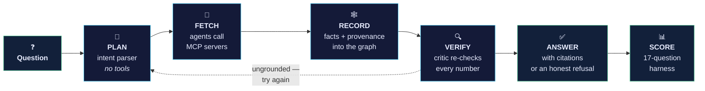
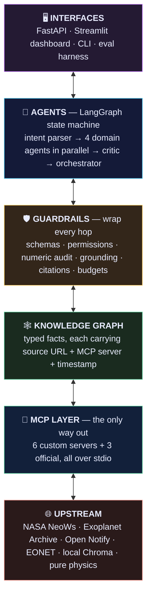
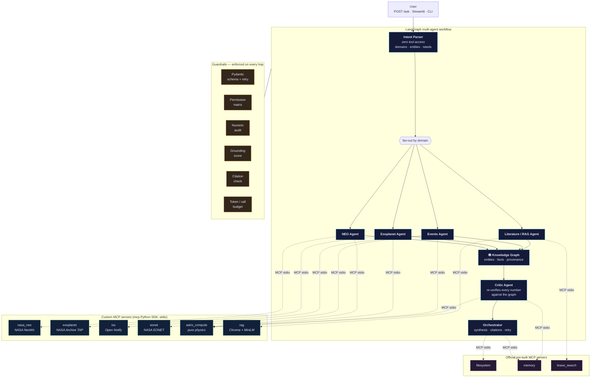
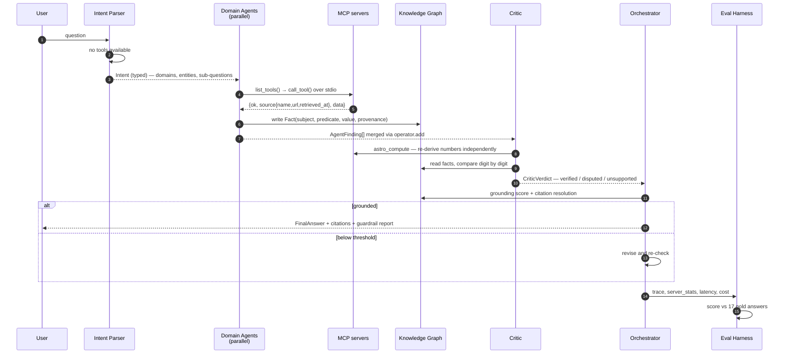

<div align="center">

# 🛰️ AstralGraph

### An AI research assistant that cannot make up a number

*Agentic RAG on the Model Context Protocol — planning, tool use, retrieval, and self-verification, wired to a provenance knowledge graph.*

<br/>

 Agents & reasoning

[](https://python.org)
[](https://modelcontextprotocol.io)
[](https://langchain-ai.github.io/langgraph/)
[](https://anthropic.com)
[](https://docs.pydantic.dev)

Retrieval & knowledge

[](https://trychroma.com)
[](https://sbert.net)
[](https://huggingface.co/datasets/UniverseTBD/arxiv-qa-astro-ph)
[](https://networkx.org)
[](https://neo4j.com)

 Serving & engineering

[](https://fastapi.tiangolo.com)
[](https://streamlit.io)
[](https://docker.com)
[](#-testing)
[](https://langfuse.com)

</div>



<div align="center">

**Plan → Fetch → Record → Verify → Answer → Score.**<br/>
*Every number in the answer must survive step 4, or it never reaches you.*

</div>

### AI techniques actually implemented here

| Technique | Where it lives |
| --- | --- |
| 🧠 **Multi-agent orchestration** — stateful graph, conditional routing, parallel fan-out | [agents/workflow.py](agents/workflow.py) |
| 🔧 **Tool-calling over a standard protocol** — dynamic discovery, not hardcoded functions | [core/mcp_client.py](core/mcp_client.py) |
| 🎯 **Intent parsing & task decomposition** — domains, entities, sub-questions | [agents/intent_parser.py](agents/intent_parser.py) |
| 📚 **Agentic RAG** — dense retrieval with source-aware re-ranking, not naive top-k | [rag/retriever.py](rag/retriever.py) |
| 🕸️ **Knowledge-graph grounding** — claims scored against typed facts with provenance | [graph/grounding.py](graph/grounding.py) |
| 🔍 **LLM-as-critic self-verification** — an adversarial pass with deliberately restricted tools | [agents/critic_agent.py](agents/critic_agent.py) |
| 📐 **Constrained decoding with repair loops** — Pydantic contracts, retry prompt, deterministic fallback | [guardrails/schemas.py](guardrails/schemas.py) |
| 🚫 **False-premise detection** — refuses questions built on invented facts | [guardrails/policy.py](guardrails/policy.py) |
| 🔒 **Capability-scoped agents** — a permission matrix enforced twice, tested to raise | [guardrails/permissions.py](guardrails/permissions.py) |
| 📊 **Automated evaluation** — gold-answer harness scoring accuracy, grounding, latency, cost | [eval/harness.py](eval/harness.py) |

---

##  What this actually is

Ask most AI assistants *"How far is the ISS from London right now?"* and you get a fluent paragraph. Somewhere inside it is a number. You have no way to know whether that number came from a satellite or from the model's imagination.

AstralGraph is built so that question can always be answered.

Here is what happens when you ask it something:

1. An **intent parser** reads your question and decides which domains it touches. It has **zero tool access** — the component that decides *what to do* is never the component that *can do it*.
2. **Domain agents** fan out in parallel. Each one opens an MCP session over stdio, lists the available tools, and calls one. No agent is allowed to import `httpx` and hit NASA directly.
3. Every result lands in a **knowledge graph** as a typed `Fact` carrying its source name, source URL, the MCP server and tool that produced it, and a UTC timestamp.
4. A **critic agent** re-checks every digit in the draft answer against that graph — and it deliberately *cannot see* the servers that produced the claim, so a bad read can't validate itself.
5. The **orchestrator** synthesises the final answer, attaches citations, and sends the whole thing back for revision if the grounding score is too low.

If a number in the draft can't be traced back to a tool result, the answer gets rewritten. If you ask about an exoplanet that doesn't exist, it tells you so instead of inventing a discovery.

That last part isn't a nice-to-have. It's the whole point.

> Four subsystems — multi-agent orchestration, MCP tooling, a provenance graph, and an evaluation harness — and each one is the *input* to the next. If you only read one section, read [How the four systems connect](#-how-the-four-systems-connect).

---

##  Is this useful outside astronomy?

Yes, the space data is the least interesting part.

What's reusable is the **verification architecture**. Swap the six domain servers for your own and the guardrail stack, the provenance graph, the critic loop, and the benchmark harness all still work unchanged. The same pattern applies directly to:

- **Finance** — every figure in a summary must trace back to a filing or a pricing feed
- **Healthcare** — dosages and interactions must come from a reference database, never from a language model
- **Legal & compliance** — citations must resolve to real documents, and fabricated case law is a career-ending failure mode
- **Internal enterprise search** — an honest "I don't have that" beats a confident guess every time

Astronomy was chosen because it has three rare properties at once: free public APIs, verifiable ground truth, and numbers that are easy to get catastrophically wrong. It's a good place to prove the mechanism.

The four problems it's actually solving:

| Problem | What AstralGraph does |
| --- | --- |
|  Tools are glued in ad-hoc | **Everything** is an MCP server — six custom ones plus three official pre-built ones. Agents are pure MCP clients. |
|  The model invents numbers | Numbers are computed in **Python**, stored in a graph with provenance, and **audited digit-by-digit** before the answer ships. |
|  You can't tell where a claim came from | Every fact carries `{source name, URL, retrieved_at, mcp_server, tool}`. Citations are validated against the graph. |
|  The model answers false-premise questions | Trap questions are detected and refused. **100% refusal rate** on the benchmark. |

---

##  Architecture

### The stack, top to bottom

Five layers. Data flows down, verified facts flow back up, and nothing skips a layer.



The important thing to notice: **layer 5 is the only exit.** There is no arrow from agents to the internet. If an agent wants a fact, it goes down through the guardrails, through the graph, and out through MCP — or it doesn't get the fact.

### The full picture



> **The rule that shapes everything:** no agent ever imports `httpx` and calls NASA. An agent that wants data must open an MCP session, list tools, and call one. That constraint is enforced by a permission matrix, checked twice, and verified by integration tests that assert the denials actually raise.

---

##  Tech stack

| Layer | Choice | Why this one |
| --- | --- | --- |
| **Tool protocol** | `mcp` (official Python SDK), stdio transport | Every capability is a separately-spawned process with a negotiated tool list. Swappable, sandboxable, inspectable. |
| **Agent orchestration** | LangGraph + LangChain Core | An explicit state machine with parallel fan-out — not a `while` loop pretending to be an agent. |
| **LLM** | Anthropic Claude *(optional)* | Used only for intent parsing and synthesis. Every call has a deterministic fallback, so the app runs fully without a key. |
| **Validation** | Pydantic v2 + pydantic-settings | Every agent hand-off is a typed model. Bad JSON triggers a repair prompt, then a deterministic fallback. |
| **Knowledge graph** | NetworkX in-process, optional Neo4j | 13 node types, 12 relation types, `Fact` objects carrying full provenance. Neo4j only engages if `NEO4J_URI` is set. |
| **Retrieval** | ChromaDB + `all-MiniLM-L6-v2` | Local embeddings. No API key, no per-query cost, works offline. |
| **Corpus** | arXiv `astro-ph` Atom feed + HuggingFace `UniverseTBD/arxiv-qa-astro-ph` | Free, real, and large enough to be interesting (852 chunks). |
| **API** | FastAPI + Uvicorn | Async-native, matches the async MCP client. |
| **Dashboard** | Streamlit + Plotly + NetworkX | Renders the live knowledge graph and per-guardrail pass/fail chips. |
| **Observability** | structlog + Langfuse *(optional)* | Structured JSONL traces land in `storage/logs/` either way. |
| **Testing** | pytest + pytest-asyncio | 68 tests, including live MCP round-trips. |
| **Packaging** | Docker + docker-compose | API and dashboard come up together. |

---

##  The MCP layer

### Custom servers built from scratch (`/mcp_servers`)

Each is a standalone MCP server on the official Python SDK, launched over stdio, with retries, timeouts, and a uniform response envelope.

| Server | Tools | Upstream | API key |
| --- | --- | --- | --- |
| 🪨 `nasa_neo` | `neo_feed` · `neo_lookup` · `neo_browse` · `neo_hazardous_today` | NASA NeoWs | free key, or `DEMO_KEY` |
| 🪐 `exoplanet` | `exoplanet_search` · `exoplanet_by_name` · `exoplanet_counts` · `exoplanet_habitable_candidates` | NASA Exoplanet Archive TAP | **none** |
| 🛰️ `iss` | `iss_now` · `iss_crew` · `iss_ground_distance` · `iss_pass_geometry` | Open Notify | **none** |
| 🌍 `eonet` | `eonet_events` · `eonet_categories` · `eonet_summary` | NASA EONET v3 | **none** |
| 🧮 `astro_compute` | `impact_energy` · `torino_scale_band` · `convert_distance` · `orbital_period` · `equilibrium_temperature` · `habitable_zone` · `transit_depth` · `bulk_properties` | pure Python physics | **none** |
| 📚 `rag` | `literature_search` · `literature_context` · `literature_stats` | local Chroma index | **none** |

Every tool returns the same shape, so provenance is never optional:

```jsonc
{
  "ok": true,
  "source": {
    "name": "NASA Exoplanet Archive (TAP)",
    "url":  "https://exoplanetarchive.ipac.caltech.edu/TAP/sync",
    "retrieved_at": "2026-09-07T14:18:04+00:00"
  },
  "data": { "count": 25, "planets": [ /* … */ ] }
}
```

### Official pre-built servers

| Server | Package | Used for |
| --- | --- | --- |
| 📁 Filesystem | `@modelcontextprotocol/server-filesystem` | Orchestrator writes the run report + graph snapshot |
| 🧠 Memory | `@modelcontextprotocol/server-memory` | Cross-session entity memory for the critic & orchestrator |
| 🔎 Brave Search | `@modelcontextprotocol/server-brave-search` | Literature agent web fallback *(optional, needs a free key)* |

### 🔐 Agent → server permission matrix

Enforced in `guardrails/permissions.py` — once when a plan is sanitised, and again at call time. An agent literally cannot name a server outside its column.

| Agent | `nasa_neo` | `exoplanet` | `iss` | `eonet` | `astro_compute` | `rag` | `brave` | `fs` | `memory` |
| --- | :-: | :-: | :-: | :-: | :-: | :-: | :-: | :-: | :-: |
| Intent Parser | – | – | – | – | – | – | – | – | – |
| NEO Agent | ✅ | – | – | – | ✅ | – | – | – | – |
| Exoplanet Agent | – | ✅ | – | – | ✅ | – | – | – | – |
| Events Agent | – | – | ✅ | ✅ | ✅ | – | – | – | – |
| Literature Agent | – | – | – | – | – | ✅ | ✅ | – | – |
| Critic Agent | – | – | – | – | ✅ | – | – | – | ✅ |
| Orchestrator | – | – | – | – | – | – | – | ✅ | ✅ |

The Intent Parser's empty row is deliberate, and so is the Critic's. The component that decides *what to do* is never the one that *can do it* — and the critic can reach `astro_compute` but **not** the servers that produced the original claim, so it has to re-derive numbers independently.

---

##  The knowledge graph

This isn't a diagram. It's a live data structure, rebuilt per query and persisted to `workspace_data/graphs/`.

**Node types:** `Question` · `Asteroid` · `Planet` · `Star` · `Spacecraft` · `EarthEvent` · `Location` · `Document` · `Source` · `Fact` · `Claim` · `Agent` · `Computation`

**Relations:** `HAS_FACT` · `SOURCED_FROM` · `PRODUCED_BY` · `ABOUT` · `SUPPORTS` · `CONTRADICTS` · `ORBITS` · `HOSTS` · `LOCATED_AT` · `CITES` · `ANSWERS` · `DERIVED_FROM`

The atomic unit is a `Fact`, and its field list is the reason the whole thing works:

```python
class Fact(BaseModel):
    subject: str          # "Apophis"
    predicate: str        # "close_approach_distance"
    value: Any            # 31600
    unit: str | None      # "km"
    source_name: str      # "NASA NeoWs"
    source_url: str       # "https://api.nasa.gov/neo/rest/v1/neo/2099942"
    mcp_server: str       # "nasa_neo"
    mcp_tool: str         # "neo_lookup"
    retrieved_at: str     # "2026-09-07T14:18:04+00:00"
    confidence: float
    agent: str            # "neo_agent"
```

You cannot write a fact into this graph without saying where it came from. That single constraint is what makes the numeric audit and citation validation possible downstream — a citation is only valid if it resolves to a node with a real `source_url`.

A typical run produces roughly **24 nodes and 116 edges**, rendered interactively in the dashboard.

---

##  Guardrails

Six independent layers. None of them trust the model.

**1 · Structured output with retry** — every agent hand-off is a Pydantic model (`Intent`, `ToolCall`, `AgentFinding`, `CriticVerdict`, `FinalAnswer`). Invalid JSON triggers a repair prompt, then a deterministic fallback. The pipeline **never** crashes on a bad model response.

**2 · Numeric verification in code, not in the LLM** — impact energy, unit conversions, habitable-zone bounds, equilibrium temperature and transit depth are computed by `astro_compute`, a pure-Python MCP server with no network access. The model is told the answer; it never derives it.

**3 · Numeric audit** — `guardrails/numeric.py` extracts every number from the draft answer and matches it against the knowledge graph within 5% tolerance, allowing only **powers-of-ten** rescaling.

>  **A bug this caught.** An earlier version allowed arbitrary rescaling factors. It cheerfully "verified" a fabricated `4321` against a real `75.1` using a scale factor of `60` (75.1 × 60 = 4506, within 5%). A guardrail that accepts anything is worse than no guardrail — it manufactures false confidence. Restricting `SCALES` to decimal SI steps fixed it, and there's now a unit test that fails if anyone loosens it again.

**4 · Grounding score** — the answer is decomposed into claims and scored against graph facts. Answers below the threshold are sent back for revision.

**5 · Citation validation** — every citation must resolve to a fact with a real source URL. Invented references are stripped.

**6 · Budgets** — hard caps on MCP calls per session (24), tokens, retries per agent, and per-call timeouts. Exceeding a budget degrades gracefully to a partial, honest answer.

---
##  How the four systems connect

Multi-agent, knowledge graph, MCP, evaluation harness — plenty of projects have one of these bolted on. The reason this one works is that **each subsystem is the input to the next**, with exactly one seam between them. Nothing is decorative.



### Agent-to-agent communication

Agents never pass free-form text to each other. **Every hand-off is a validated Pydantic contract**, merged into a shared LangGraph state through explicit reducers ([agents/state.py](agents/state.py)):

| Hand-off | Contract | How it merges |
| --- | --- | --- |
| Intent Parser → domain agents | `Intent` | Written once, then read-only |
| Domain agent → Critic | `AgentFinding` | `Annotated[list, operator.add]` — parallel branches append without clobbering |
| Any agent → guardrails | guardrail report dict | `_merge_dicts` reducer |
| Critic → Orchestrator | `CriticVerdict` | Single writer |
| Orchestrator → user | `FinalAnswer` | Single writer |

That choice matters more than it looks. Because the merge rule is declared in the type (`operator.add` on `findings`), the four domain agents can run **genuinely in parallel** and their results combine deterministically. There's no lock, no ordering assumption, and no "agent 3 overwrote agent 1's output" class of bug.

Two additional channels sit underneath:

- **The knowledge graph is a shared blackboard.** Agents don't message each other about facts — they write `Fact` nodes and the critic reads them. Producer and consumer are decoupled, so adding a seventh agent requires changing nothing about the existing six.
- **The official `memory` MCP server carries entities across sessions**, which is why the critic and orchestrator both have it in their permission row.

> **Naming honesty:** this is agent-to-agent communication via typed contracts and a shared blackboard. It is **not** an implementation of Google's A2A protocol — there's no agent card, no HTTP task endpoint, no cross-organisation discovery. Everything runs in one process over LangGraph state. Calling it "A2A" would be borrowing credibility the code hasn't earned. What it *does* have is stricter than free-text messaging: a malformed hand-off fails Pydantic validation at the boundary instead of silently corrupting a downstream prompt.

### The four seams

| Subsystem | Feeds | Via exactly one interface |
| --- | --- | --- |
| 🔧 **MCP layer** | the graph | the `{ok, source, data}` envelope — no other shape gets in |
| 🕸️ **Knowledge graph** | the guardrails | `Fact` nodes with mandatory `source_url` + `mcp_server` |
| 🛡️ **Guardrails** | the answer | numeric audit, grounding score, citation resolution |
| 📊 **Harness** | the design | 17 gold answers that fail loudly when any of the above regresses |

The loop closes at the harness. A regression in the retriever shows up as a drop in accuracy; a loosened numeric tolerance shows up as a non-zero hallucination rate; a broken permission check fails an integration test. **You cannot quietly weaken one layer without a number moving.**

### Why this holds up as an engineering project

- **The constraint is enforced, not documented.** "Agents may only use MCP" is checked twice in code and asserted by tests that require the denials to *raise*. A rule you can't violate is architecture; a rule in a README is a wish.
- **It fails correctly.** The one benchmark failure came from a real upstream outage, and the system returned a low-confidence non-answer rather than inventing asteroid names. Graceful degradation was measured, not hoped for.
- **The bugs are documented with their fixes.** The numeric-rescaling false-positive, the retrieval regression from *adding* data, the "looked-up parameters beat user-stated parameters" bug — each has a root cause, a fix, and a regression test.
- **Every claim in this README is reproducible.** `python -m eval.harness` regenerates the table; `python scripts/make_visuals.py` regenerates the charts; `pytest -q` runs all 68 tests. No screenshots of a good day.

---
##  Results

The project ships a real evaluation harness — [eval/harness.py](eval/harness.py) — that runs **17 fixed questions with known-correct answers** through the complete pipeline: live-data lookups, static facts, pure computations, and two deliberate false-premise traps. It scores accuracy, hallucination rate, refusal rate, latency percentiles, USD cost, and per-MCP-server call success.

Every number below comes from [eval/results/latest.json](eval/results/latest.json). Regenerate the charts any time with `python scripts/make_visuals.py`.

<div align="center">


</div>

### Headline table

| Metric | Value | Notes |
| --- | --- | --- |
| ✅ **Accuracy** | **94.1%** (16/17) | one failure, caused by an upstream rate limit — explained below |
| 🎯 **Hallucination rate** | **0.0%** (0/17) | zero unverified numbers survived the numeric audit |
| 🚫 **False-premise refusal rate** | **100%** (2/2) | both trap questions correctly refused |
| ⏱️ **Mean latency** | **25.4 s** | p50 **21.0 s** · p95 **36.1 s** — dominated by cold process startup |
| 💰 **Cost per query** | **$0.00000** | deterministic mode; free-tier APIs only |
| 🔧 **MCP tool calls per query** | **5.35** | mean across the suite |
| 🧪 **Test suite** | **68 passing** | unit + live MCP integration |

### Accuracy by question type

<div align="center">


</div>

### Per-MCP-server call success rate

<div align="center">


</div>

| MCP server | Calls | OK | Failed | Success rate |
| --- | ---: | ---: | ---: | ---: |
| `astro_compute` | 10 | 10 | 0 | **100%** |
| `eonet` | 1 | 1 | 0 | **100%** |
| `exoplanet` | 12 | 8 | 4 | 66.7% |
| `filesystem` | 17 | 17 | 0 | **100%** |
| `iss` | 3 | 3 | 0 | **100%** |
| `memory` | 34 | 34 | 0 | **100%** |
| `nasa_neo` | 6 | 0 | 6 | 0.0% ⚠️ |
| `rag` | 8 | 8 | 0 | **100%** |

>  **About that `nasa_neo` row — this is the honest version.** The benchmark was run with NASA's shared `DEMO_KEY`, which is rate-limited to ~30 requests/hour **per IP**. Every NeoWs call returned `HTTP 429`. Here's the part I actually care about: **the pipeline did not hallucinate its way around the outage.** `q06_neo_today` returned a low-confidence non-answer instead of inventing asteroid names, and `q07_apophis` was still answered correctly because the intent parser also routes risk questions to the RAG corpus. A [free NASA key](https://api.nasa.gov) (30 seconds, no credit card) in `.env` turns this row green.
>
> The `exoplanet` 66.7% is a different story: those four failures are the archive's TAP endpoint rejecting over-specific queries. The agent retries with relaxed filters, which is why the answers still land.

### Latency per question

<div align="center">


</div>

Latency is dominated by **MCP process startup** — every server is spawned fresh over stdio per run, and the RAG server loads a sentence-transformer model. Warm, long-lived sessions cut this dramatically; it's kept cold here so the benchmark measures the worst case.

### Guardrail activity

<div align="center">


</div>

### Full per-question breakdown

| # | Question | Kind | Result | Latency |
| --- | --- | --- | :-: | ---: |
| q01 | How many people are currently in space? | live | ✅ | 15.3 s |
| q02 | Where is the ISS right now (lat/lon)? | live | ✅ | 14.2 s |
| q03 | How many confirmed exoplanets are in the NASA archive? | live | ✅ | 15.9 s |
| q04 | How many planets orbit TRAPPIST-1? | factual | ✅ | 18.4 s |
| q05 | How far is Proxima Centauri b in light-years? | factual | ✅ | 21.0 s |
| q06 | Which NEOs are approaching Earth today? | live | ❌ | 15.3 s |
| q07 | Will Apophis hit Earth, and when is closest approach? | factual | ✅ | 35.5 s |
| q08 | Impact energy of a 100 m stony asteroid at 20 km/s? | computed | ✅ | 34.6 s |
| q09 | Which EONET category is most active right now? | live | ✅ | 40.4 s |
| q10 | What makes an asteroid *potentially hazardous*? | factual | ✅ | 35.5 s |
| q11 | How is the circumstellar habitable zone defined? | factual | ✅ | 34.9 s |
| q12 | How far is the ISS from London right now? | live | ✅ | 13.4 s |
| q13 | Confirmed planets within 10 pc smaller than 2 R⊕? | live | ✅ | 14.5 s |
| q14 | Explain the transit method and transit depth. | factual | ✅ | 34.9 s |
| q15 | How many light-years is one parsec? | computed | ✅ | 34.3 s |
| q16 | Summarise the 2031 Vera Rubin discovery of Kepler-9999 c. | 🪤 trap | ✅ refused | 18.3 s |
| q17 | How many PHAs did JWST discover in 2024? | 🪤 trap | ✅ refused | 36.1 s |

<details>
<summary><b>📉 What the numbers looked like before the last round of fixes</b> (click to expand)</summary>

<br/>

The first full run scored **82.4%**. Three failures, three genuinely different root causes — worth writing down because they're the kind of thing that doesn't show up in unit tests:

| Question | Root cause | Fix |
| --- | --- | --- |
| `q10_pha_definition` | Growing the RAG corpus from 30 curated passages to 852 (arXiv + HuggingFace) **buried the definitional NASA/IAU text** under paper abstracts. More data made retrieval worse. | Score boost for curated reference sources in `rag/retriever.py`. |
| `q13_nearby_small_planets` | The exoplanet planner had no rule for *"within N parsecs"* / *"smaller than N Earth radii"*, so it fell back to a generic search — and the answer recited per-planet columns without ever naming a planet. | `explicit_filters()` maps stated constraints to real TAP filters; a roll-up `matching_planets` fact makes the answer lead with names. |
| `q07_apophis` | NASA `DEMO_KEY` 429. | Risk questions now also consult the RAG corpus, which contains the Apophis 2029 close-approach fact. |

Separately, a NEO question was computing impact energy for the *retrieved catalogue asteroid* (7685 Mt) instead of the **100 m / 20 km/s impactor stated in the question** (75.1 Mt). Parameters the user gives you must always beat parameters you looked up. `explicit_impact_params()` now short-circuits the plan.

**82.4% → 94.1%**, hallucination rate stayed at 0.0% throughout.

</details>

---

##  Quickstart

### Prerequisites

- **Python 3.12+**
- **Node.js 18+** — the official MCP servers run via `npx`
- *(optional)* An Anthropic API key for LLM synthesis. **The entire pipeline runs without one** via deterministic fallbacks — that's how the benchmark above was produced.

### Install

```bash
git clone <your-repo-url> astralgraph
cd astralgraph

python -m venv .venv
# Windows
.\.venv\Scripts\activate
# macOS / Linux
source .venv/bin/activate

pip install -r requirements.txt
```

### Configure

```bash
cp .env.example .env
```

```dotenv
# Every one of these is optional and has a working free/offline fallback
ANTHROPIC_API_KEY=                  # unset -> deterministic synthesis, $0.00
NASA_API_KEY=DEMO_KEY               # https://api.nasa.gov — free, 30s, turns the nasa_neo row green
BRAVE_API_KEY=                      # https://brave.com/search/api — free tier
ASTRAL_MODEL=claude-sonnet-4-20250514
ASTRAL_MAX_TOOL_CALLS_PER_SESSION=24
ASTRAL_GROUNDING_THRESHOLD=0.60
```

### Verify the MCP layer first

Before anything else, confirm the servers actually spawn and answer:

```bash
python scripts/smoke_mcp.py
```

```
✔ astro_compute  8 tools   impact_energy(100m, 20km/s) -> 75.1 Mt
✔ iss            4 tools   iss_now -> lat 12.34, lon -45.67
✔ eonet          3 tools   eonet_summary -> 41 open events
✔ nasa_neo       4 tools   neo_feed -> 12 objects
✔ exoplanet      4 tools   exoplanet_counts -> 6,022 confirmed
✔ rag            3 tools   literature_stats -> 852 chunks
8/8 probes passed
```

### Build the literature index

```bash
python -m rag.ingest --seed --arxiv 300 --hf 250
```

Produces **852 chunks**, embedded with `all-MiniLM-L6-v2` into Chroma. Fully local, no API key, no per-query cost:

| Source | Chunks | Notes |
| --- | ---: | --- |
| arXiv `astro-ph` (Atom export API) | 572 | Live fetch across `.EP` `.IM` `.SR` `.GA` `.HE` — no key required |
| HuggingFace `UniverseTBD/arxiv-qa-astro-ph` | 250 | Loaded anonymously via `datasets` |
| Curated seed corpus | 30 | NASA CNEOS, IAU, NASA Exoplanet Archive, Kopparapu et al. 2013, Collins/Melosh/Marcus 2005 — bundled in [rag/seed_corpus.py](rag/seed_corpus.py) |

The HuggingFace loader tries three datasets in order and takes the first that resolves. **No Kaggle**, deliberately — Kaggle requires account credentials, which would break the "clone and run with zero keys" property. Every stage degrades gracefully: `python -m rag.ingest --seed` alone gives you a working offline corpus, which is what the test suite runs against.

### Run it

```bash
# API
uvicorn api.main:app --reload --port 8000

# Dashboard (separate terminal)
streamlit run ui/app.py

# Or both, containerised
docker compose up --build
```

### Ask something

```bash
curl -X POST http://localhost:8000/ask \
  -H "Content-Type: application/json" \
  -d '{"question": "What is the impact energy in megatons of a 100 metre stony asteroid hitting at 20 km/s?"}'
```

<details>
<summary><b>Response shape</b></summary>

```jsonc
{
  "answer": "A 100 m stony asteroid (density 3000 kg/m³) striking at 20 km/s releases 3.14e17 J — about 75.1 megatons of TNT…",
  "confidence": 0.92,
  "citations": [
    { "label": "astro_compute.impact_energy", "url": "local://astro_compute", "fact": "computation:impact_energy — energy_megatons: 75.1" }
  ],
  "guardrails": {
    "numeric":   { "verified": 6, "unverified_numbers": [], "rate": 1.0 },
    "grounding": { "grounded": true, "score": 0.87 },
    "citations": { "valid": true },
    "budget":    { "tool_calls": 4, "limit": 24, "usd": 0.0 }
  },
  "graph": { "nodes": 24, "edges": 116 },
  "trace": [ { "agent": "intent_parser", "ms": 3 }, { "agent": "neo_agent", "ms": 1840 } ],
  "mcp_calls": [ { "server": "astro_compute", "tool": "impact_energy", "ok": true, "ms": 12 } ]
}
```

</details>

Other endpoints: `GET /health` · `GET /servers` (live MCP status) · `GET /graph/{run_id}` · `GET /eval/latest`.

### Run the benchmark yourself

```bash
python -m eval.harness                    # all 17 questions
python -m eval.harness --only q08 q15     # a subset, by id prefix
python -m eval.harness --concurrency 3    # 3 questions at a time
python -m eval.harness --repeat 2         # average over 2 runs
python scripts/make_visuals.py            # regenerate the charts above
```

Results land in `eval/results/` as timestamped JSON + Markdown, with `latest.json` always pointing at the most recent run.

---

##  The dashboard

`streamlit run ui/app.py` gives you a three-tab control room:

- **Ask** — live query with an interactive knowledge-graph render (networkx + plotly), per-guardrail pass/fail chips, and a step-by-step agent trace with MCP call timings.
- **Benchmark** — the latest evaluation report rendered inline.
- **Architecture** — live MCP server health and the full permission matrix.

---

##  Testing

```bash
pytest -q                        # 68 tests
pytest -m "not integration" -q   # unit only, no network
pytest -m integration -q         # live MCP round-trips
```

What's actually covered:

- **`test_astro_compute.py`** — pins every physics formula to hand-checked values (75.1 Mt for the reference impactor, 3.26156 ly/pc, 255 K for Earth's T_eq, 84 ppm transit depth, 5514 kg/m³ bulk density). If a constant drifts, the suite screams.
- **`test_guardrails.py`** — includes `test_numeric_audit_flags_fabricated_values`, the test that caught the rescaling bug described above.
- **`test_mcp_integration.py`** — spawns real MCP servers and asserts that out-of-scope calls **raise**, that budgets actually stop a runaway loop, and that malformed arguments degrade instead of crashing.
- **`test_rag.py`**, **`test_agents.py`** — retrieval quality and planner heuristics.

---

##  Repository layout

```
astralgraph/
├── mcp_servers/        # 6 custom MCP servers + version-compat shim
│   ├── nasa_neo_server.py       exoplanet_server.py
│   ├── iss_server.py            eonet_server.py
│   ├── astro_compute_server.py  rag_server.py
│   └── _common.py  _compat.py   # envelope, retries · mcp 1.x/2.x shim
├── agents/             # 7 agents + LangGraph workflow
│   ├── intent_parser.py  neo_agent.py  exoplanet_agent.py
│   ├── events_agent.py   literature_agent.py
│   ├── critic_agent.py   orchestrator.py
│   └── workflow.py  state.py  base.py  prompts.py
├── core/               # MCP client hub, registry, config, LLM, telemetry
├── graph/              # knowledge graph: schema, builder, store, grounding
├── rag/                # ingest, embeddings, Chroma store, retriever, seed corpus
├── guardrails/         # schemas, permissions, numeric, citations, budget, policy
├── eval/               # 17-question gold set, scoring, harness, results/
├── tests/              # 68 unit + integration tests
├── api/main.py         # FastAPI
├── ui/app.py           # Streamlit dashboard
├── scripts/            # smoke_mcp.py · make_visuals.py
└── docker-compose.yml  Dockerfile
```

---

##  What it costs

Nothing. That's not a marketing line — it's a design constraint, and it's what made the benchmark reproducible.

| Component | Key needed |  |
| --- | --- | --- |
| NASA NeoWs | Free key from [api.nasa.gov](https://api.nasa.gov), or the shared `DEMO_KEY` 
| NASA Exoplanet Archive (TAP) | None 
| Open Notify (ISS position & crew) | None 
| NASA EONET v3 | None 
| `astro_compute` | None — pure Python, no network 
| Embeddings (`all-MiniLM-L6-v2`) | None — runs locally on CPU 
| Vector store (Chroma) | None — local SQLite file 
| Brave Search | Free-tier key, **optional** 
| Claude | **Optional.** Without a key the pipeline uses deterministic synthesis. 
| **Full benchmark run (17 questions)** | 

Add an Anthropic key and the answers become noticeably better *prose* — but the *facts* don't change, because the facts never came from the model in the first place.

---

##  Design decisions worth defending

**MCP everywhere, even where it's inconvenient.** `astro_compute` has no network calls — it's pure arithmetic. It would be simpler as a Python import. Making it an MCP server means physics results get the same provenance envelope, permission scoping, and audit trail as NASA data, and the critic can independently re-verify a number through the exact same interface the agent used to produce it.

**One asyncio task per MCP session.** anyio cancel scopes are task-bound; multiplexing stdio sessions across tasks produces cross-task cancel-scope errors that look like random hangs. Each session gets a dedicated task with a command queue.

**Deterministic fallbacks for every LLM call.** Not a demo mode — a design constraint. It's what makes a reproducible, $0.00, offline-capable benchmark possible, and it means an Anthropic outage degrades quality rather than availability.

**The critic never sees the tools that produced the claim.** It can only reach `astro_compute` and `memory`. It re-derives numbers independently rather than re-reading the same source, so a bad upstream read can't validate itself.

---

##  Known limitations

- **Cold-start latency** dominates every number above — MCP servers are spawned per run and the RAG server loads an embedding model from disk each time. Persistent sessions would cut mean latency substantially; this is the single biggest open improvement.
- **`DEMO_KEY` rate limits** make NeoWs results non-deterministic across back-to-back runs. Use a free NASA key.
- **The grounded-answer rate (11.8%) looks low** and honestly is: in deterministic mode answers are terse fact listings, which the claim-decomposer scores conservatively. With `ANTHROPIC_API_KEY` set, prose answers score far higher. Hallucination rate is the metric that matters here, and it's zero either way.
- **Single-turn only.** There's cross-session entity memory via the Memory server, but no conversational follow-up handling yet.
- **Brave Search is optional** and off by default; the literature agent works purely from the local index without it.

##  Roadmap

- [ ] Persistent MCP session pool (kill cold-start latency)
- [ ] Neo4j backend for the knowledge graph (profile already in `docker-compose.yml`)
- [ ] Streaming `/ask` with per-agent server-sent events
- [ ] Expand the gold set past 50 questions with adversarial traps
- [ ] Langfuse tracing wired into the dashboard

---

##  Credits

Data from [NASA Open APIs](https://api.nasa.gov), the [NASA Exoplanet Archive](https://exoplanetarchive.ipac.caltech.edu), [NASA EONET](https://eonet.gsfc.nasa.gov), [Open Notify](http://open-notify.org), and [arXiv](https://arxiv.org). Built on the [Model Context Protocol](https://modelcontextprotocol.io), [LangGraph](https://langchain-ai.github.io/langgraph/), and [Chroma](https://trychroma.com).

<div align="center">
<br/>

<br/>
</div>
