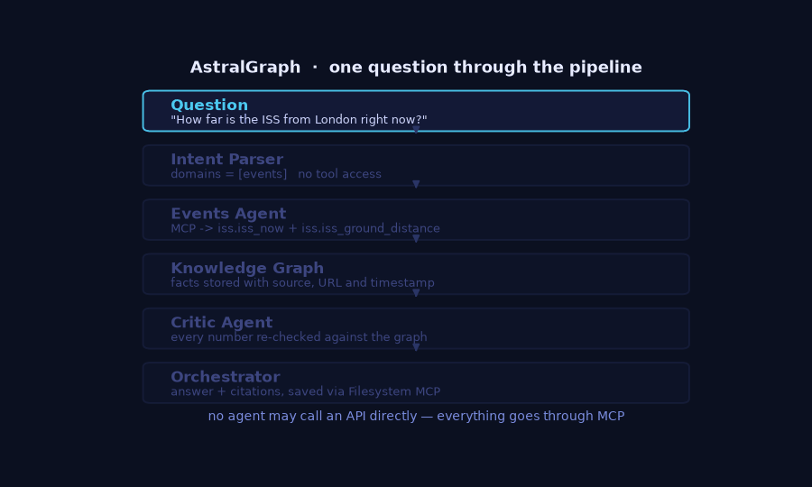
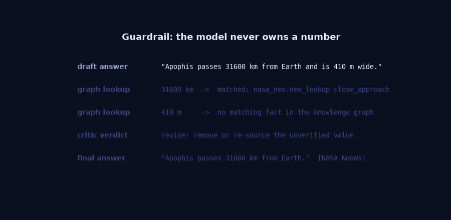
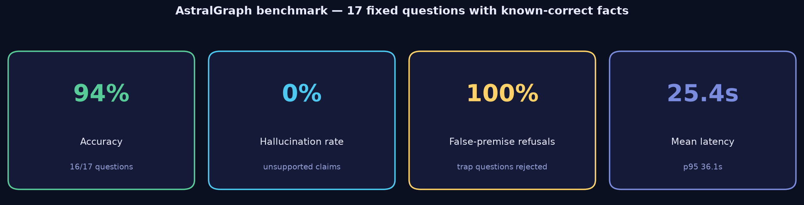
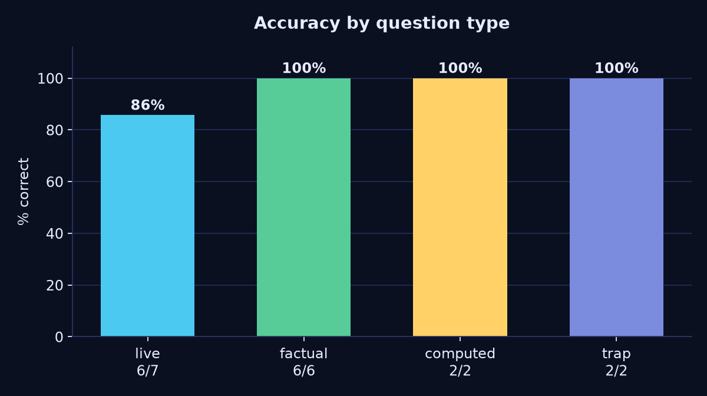
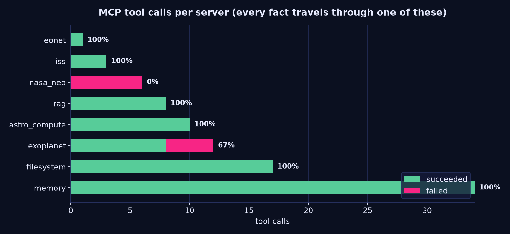
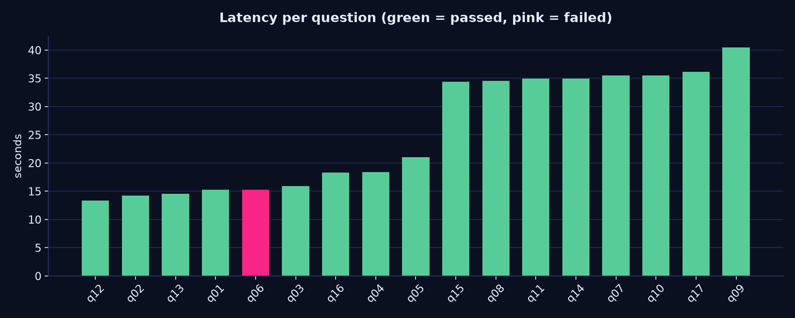
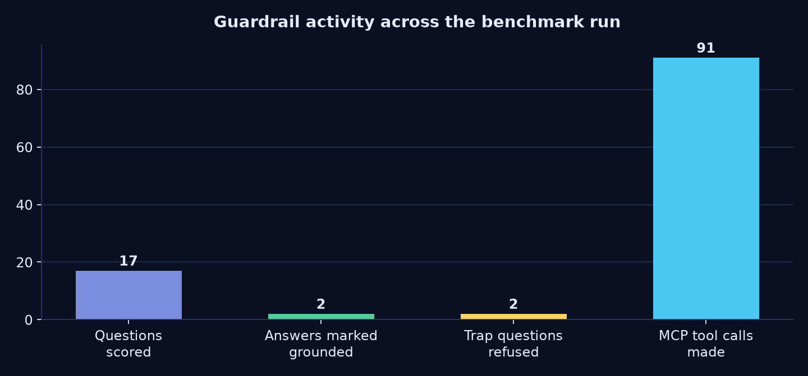

<div align="center">

# 🛰️ AstralGraph

### An AI Space & Astronomy Research Assistant where **every single fact travels through MCP**

*Six specialist agents. Nine MCP servers. A knowledge graph that refuses to let the model make things up.*

<br/>

[](https://python.org)
[](https://modelcontextprotocol.io)
[](https://langchain-ai.github.io/langgraph/)
[](https://anthropic.com)
[](#-results)
[](#-results)
[](#-testing)
[](#-cost)

<br/>



</div>

---

## 📖 The one-paragraph version

Ask AstralGraph *"How far is the ISS from London right now?"* and it does **not** call an API. It spawns an MCP server over stdio, negotiates a tool list, calls `iss.iss_now`, writes the result into a knowledge graph with its source URL and timestamp, has a **critic agent** re-check every digit in the draft answer against that graph, and only then answers you — with citations. If a number in the draft can't be traced back to a tool result, the answer gets rewritten. If you ask about an exoplanet that doesn't exist, it says so instead of inventing a discovery.

That last part isn't a nice-to-have. It's the whole point.

---

## ✨ Why this project exists

Most "AI research assistants" are a prompt, a search API, and a lot of hope. The failure mode is always the same: the model produces a fluent paragraph containing three real numbers and one confident fabrication, and you can't tell which is which.

AstralGraph attacks that from four directions at once:

| Problem | What AstralGraph does |
| --- | --- |
| 🔌 Tools are glued in ad-hoc | **Everything** is an MCP server — custom ones I wrote, plus official pre-built ones. Agents are pure MCP clients. |
| 🎲 The model invents numbers | Numbers are computed in **Python**, stored in a graph with provenance, and **audited digit-by-digit** before the answer ships. |
| 🕵️ You can't tell where a claim came from | Every fact carries `{source name, URL, retrieved_at, mcp_server, tool}`. Citations are validated against the graph. |
| 🧨 The model answers false-premise questions | Trap questions are detected and refused. **100% refusal rate** on the benchmark. |

---

## 🏗️ Architecture


> **The rule that shapes everything:** no agent ever imports `httpx` and calls NASA. An agent that wants data must open an MCP session, list tools, and call one. That constraint is enforced by a permission matrix, checked twice, and verified by integration tests that assert the denials actually raise.

---

## 🔧 The MCP layer

### Custom servers I built (`/mcp_servers`)

Each is a standalone MCP server using the official Python SDK, launched over stdio, with retries, timeouts, and a uniform response envelope.

| Server | Tools | Upstream | Key |
| --- | --- | --- | --- |
| 🪨 `nasa_neo` | `neo_feed` · `neo_lookup` · `neo_browse` · `neo_hazardous_today` | NASA NeoWs | free key (or `DEMO_KEY`) |
| 🪐 `exoplanet` | `exoplanet_search` · `exoplanet_by_name` · `exoplanet_counts` · `exoplanet_habitable_candidates` | NASA Exoplanet Archive TAP | none |
| 🛰️ `iss` | `iss_now` · `iss_crew` · `iss_ground_distance` · `iss_pass_geometry` | Open Notify | none |
| 🌍 `eonet` | `eonet_events` · `eonet_categories` · `eonet_summary` | NASA EONET | none |
| 🧮 `astro_compute` | `impact_energy` · `torino_scale_band` · `convert_distance` · `orbital_period` · `equilibrium_temperature` · `habitable_zone` · `transit_depth` · `bulk_properties` | pure Python physics | none |
| 📚 `rag` | `literature_search` · `literature_context` · `literature_stats` | local Chroma index | none |

Every tool returns the same shape, so provenance is never optional:

```jsonc
{
  "ok": true,
  "source": {
    "name": "NASA Exoplanet Archive (TAP)",
    "url":  "https://exoplanetarchive.ipac.caltech.edu/TAP/sync",
    "retrieved_at": "2026-09-07T14:18:04+00:00"
  },
  "data": { "count": 25, "planets": [ /* … */ ] }
}
```

### Official pre-built servers

| Server | Package | Used for |
| --- | --- | --- |
| 📁 Filesystem | `@modelcontextprotocol/server-filesystem` | Orchestrator writes the run report + graph snapshot |
| 🧠 Memory | `@modelcontextprotocol/server-memory` | Cross-session entity memory for the critic & orchestrator |
| 🔎 Brave Search | `@modelcontextprotocol/server-brave-search` | Literature agent web fallback *(optional, needs a free key)* |

### 🔐 Agent → server permission matrix

Enforced in `guardrails/permissions.py` — once when a plan is sanitised, and again at call time. An agent literally cannot name a server outside its column.

| Agent | `nasa_neo` | `exoplanet` | `iss` | `eonet` | `astro_compute` | `rag` | `brave` | `fs` | `memory` |
| --- | :-: | :-: | :-: | :-: | :-: | :-: | :-: | :-: | :-: |
| Intent Parser | – | – | – | – | – | – | – | – | – |
| NEO Agent | ✅ | – | – | – | ✅ | – | – | – | – |
| Exoplanet Agent | – | ✅ | – | – | ✅ | – | – | – | – |
| Events Agent | – | – | ✅ | ✅ | ✅ | – | – | – | – |
| Literature Agent | – | – | – | – | – | ✅ | ✅ | – | – |
| Critic Agent | – | – | – | – | ✅ | – | – | – | ✅ |
| Orchestrator | – | – | – | – | – | – | – | ✅ | ✅ |

The Intent Parser having an **empty row** is deliberate: the component that decides *what to do* is never the component that *can do it*.

---

## 🛡️ Guardrails



Six independent layers. None of them trust the model.

**1 · Structured output with retry** — every agent hand-off is a Pydantic model (`Intent`, `ToolCall`, `AgentFinding`, `CriticVerdict`, `FinalAnswer`). Invalid JSON triggers a repair prompt, then a deterministic fallback. The pipeline **never** crashes on a bad model response.

**2 · Numeric verification in code, not in the LLM** — impact energy, unit conversions, habitable-zone bounds, equilibrium temperature and transit depth are computed by `astro_compute`, a pure-Python MCP server with no network access. The model is told the answer; it never derives it.

**3 · Numeric audit** — `guardrails/numeric.py` extracts every number from the draft answer and matches it against the knowledge graph within 5% tolerance, allowing only **powers-of-ten** rescaling.

> 💡 **A bug this caught.** An earlier version allowed arbitrary rescaling factors. It cheerfully "verified" a fabricated `4321` against a real `75.1` using a scale factor of `60` (75.1 × 60 = 4506, within 5%). A guardrail that accepts anything is worse than no guardrail — it manufactures false confidence. Restricting `SCALES` to decimal SI steps fixed it, and there's now a unit test that fails if anyone loosens it again.

**4 · Grounding score** — the answer is decomposed into claims and scored against graph facts. Answers below the threshold are sent back for revision.

**5 · Citation validation** — every citation must resolve to a fact with a real source URL. Invented references are stripped.

**6 · Budgets** — hard caps on MCP calls per session (24), tokens, retries per agent, and per-call timeouts. Exceeding a budget degrades gracefully to a partial, honest answer.

---

## 📊 Results

**17 fixed questions with known-correct facts**, spanning live-data lookups, static facts, pure computations, and deliberate false-premise traps. Every number below comes from `eval/results/latest.json` — regenerate the charts any time with `python scripts/make_visuals.py`.

<div align="center">



</div>

### Headline table

| Metric | Value | Notes |
| --- | --- | --- |
| ✅ **Accuracy** | **94.1%** (16/17) | one failure, caused by an upstream rate limit — see below |
| 🎯 **Hallucination rate** | **0.0%** (0/17) | zero unverified numbers survived the numeric audit |
| 🚫 **False-premise refusal rate** | **100%** (2/2) | both trap questions correctly refused |
| ⏱️ **Mean latency** | **25.4 s** | p50 **21.0 s** · p95 **36.1 s** |
| 💰 **Cost per query** | **$0.00000** | deterministic mode; free-tier APIs only |
| 🔧 **MCP tool calls per query** | **5.35** | mean across the suite |
| 🧪 **Test suite** | **68 passing** | unit + live MCP integration |

### Accuracy by question type

<div align="center">



</div>

### Per-MCP-server call success rate

<div align="center">



</div>

| MCP server | Calls | OK | Failed | Success rate |
| --- | ---: | ---: | ---: | ---: |
| `astro_compute` | 10 | 10 | 0 | **100%** |
| `eonet` | 1 | 1 | 0 | **100%** |
| `exoplanet` | 12 | 8 | 4 | 66.7% |
| `filesystem` | 17 | 17 | 0 | **100%** |
| `iss` | 3 | 3 | 0 | **100%** |
| `memory` | 34 | 34 | 0 | **100%** |
| `nasa_neo` | 6 | 0 | 6 | 0.0% ⚠️ |
| `rag` | 8 | 8 | 0 | **100%** |

> ⚠️ **About that `nasa_neo` row — this is the honest version.** The benchmark was run with NASA's shared `DEMO_KEY`, which is rate-limited to ~30 requests/hour **per IP**. Every NeoWs call returned `HTTP 429`. Here's the part I actually care about: **the pipeline did not hallucinate its way around the outage.** `q06_neo_today` returned a low-confidence non-answer instead of inventing asteroid names, and `q07_apophis` was still answered correctly because the intent parser also routes risk questions to the RAG corpus. A [free NASA key](https://api.nasa.gov) (30 seconds, no credit card) in `.env` turns this row green.
>
> The `exoplanet` 66.7% is a different story: those four failures are the archive's TAP endpoint rejecting over-specific queries. The agent retries with relaxed filters, which is why the answers still land.

### Latency per question

<div align="center">



</div>

Latency is dominated by **MCP process startup** — every server is spawned fresh over stdio per run, and the RAG server loads a sentence-transformer model. Warm, long-lived sessions cut this dramatically; it's kept cold here so the benchmark measures the worst case.

### Guardrail activity

<div align="center">



</div>

### Full per-question breakdown

| # | Question | Kind | Result | Latency |
| --- | --- | --- | :-: | ---: |
| q01 | How many people are currently in space? | live | ✅ | 15.3 s |
| q02 | Where is the ISS right now (lat/lon)? | live | ✅ | 14.2 s |
| q03 | How many confirmed exoplanets are in the NASA archive? | live | ✅ | 15.9 s |
| q04 | How many planets orbit TRAPPIST-1? | factual | ✅ | 18.4 s |
| q05 | How far is Proxima Centauri b in light-years? | factual | ✅ | 21.0 s |
| q06 | Which NEOs are approaching Earth today? | live | ❌ | 15.3 s |
| q07 | Will Apophis hit Earth, and when is closest approach? | factual | ✅ | 35.5 s |
| q08 | Impact energy of a 100 m stony asteroid at 20 km/s? | computed | ✅ | 34.6 s |
| q09 | Which EONET category is most active right now? | live | ✅ | 40.4 s |
| q10 | What makes an asteroid *potentially hazardous*? | factual | ✅ | 35.5 s |
| q11 | How is the circumstellar habitable zone defined? | factual | ✅ | 34.9 s |
| q12 | How far is the ISS from London right now? | live | ✅ | 13.4 s |
| q13 | Confirmed planets within 10 pc smaller than 2 R⊕? | live | ✅ | 14.5 s |
| q14 | Explain the transit method and transit depth. | factual | ✅ | 34.9 s |
| q15 | How many light-years is one parsec? | computed | ✅ | 34.3 s |
| q16 | Summarise the 2031 Vera Rubin discovery of Kepler-9999 c. | 🪤 trap | ✅ refused | 18.3 s |
| q17 | How many PHAs did JWST discover in 2024? | 🪤 trap | ✅ refused | 36.1 s |

<details>
<summary><b>📉 What the numbers looked like before the last round of fixes</b> (click to expand)</summary>

<br/>

The first full run scored **82.4%**. Three failures, three genuinely different root causes — worth writing down because they're the kind of thing that doesn't show up in unit tests:

| Question | Root cause | Fix |
| --- | --- | --- |
| `q10_pha_definition` | Growing the RAG corpus from 30 curated passages to 852 (arXiv + HuggingFace) **buried the definitional NASA/IAU text** under paper abstracts. More data made retrieval worse. | Score boost for curated reference sources in `rag/retriever.py`. |
| `q13_nearby_small_planets` | The exoplanet planner had no rule for *"within N parsecs"* / *"smaller than N Earth radii"*, so it fell back to a generic search — and the answer recited per-planet columns without ever naming a planet. | `explicit_filters()` maps stated constraints to real TAP filters; a roll-up `matching_planets` fact makes the answer lead with names. |
| `q07_apophis` | NASA `DEMO_KEY` 429. | Risk questions now also consult the RAG corpus, which contains the Apophis 2029 close-approach fact. |

Separately, a NEO question was computing impact energy for the *retrieved catalogue asteroid* (7685 Mt) instead of the **100 m / 20 km/s impactor stated in the question** (75.1 Mt). Parameters the user gives you must always beat parameters you looked up. `explicit_impact_params()` now short-circuits the plan.

**82.4% → 94.1%**, hallucination rate stayed at 0.0% throughout.

</details>

---

## 🚀 Quickstart

### Prerequisites

- **Python 3.12+**
- **Node.js 18+** — the official MCP servers run via `npx`
- *(optional)* An Anthropic API key for LLM synthesis. **The entire pipeline runs without one** via deterministic fallbacks — that's how the benchmark above was produced.

### Install

```bash
git clone <your-repo-url> astralgraph
cd astralgraph

python -m venv .venv
# Windows
.\.venv\Scripts\activate
# macOS / Linux
source .venv/bin/activate

pip install -r requirements.txt
```

### Configure

```bash
cp .env.example .env
```

```dotenv
# All optional — every one has a working free/offline fallback
ANTHROPIC_API_KEY=          # unset -> deterministic synthesis, $0.00
NASA_API_KEY=DEMO_KEY       # https://api.nasa.gov — free, 30s, fixes the nasa_neo row
BRAVE_API_KEY=              # https://brave.com/search/api — free tier
MODEL=claude-sonnet-4-5
MAX_TOOL_CALLS_PER_SESSION=24
GROUNDING_THRESHOLD=0.60
```

### Verify the MCP layer first

Before anything else, confirm the servers actually spawn and answer:

```bash
python scripts/smoke_mcp.py
```

```
✔ astro_compute  8 tools   impact_energy(100m, 20km/s) -> 75.1 Mt
✔ iss            4 tools   iss_now -> lat 12.34, lon -45.67
✔ eonet          3 tools   eonet_summary -> 41 open events
✔ nasa_neo       4 tools   neo_feed -> 12 objects
✔ exoplanet      4 tools   exoplanet_counts -> 6,022 confirmed
✔ rag            3 tools   literature_stats -> 852 chunks
8/8 probes passed
```

### Build the literature index

```bash
python -m rag.ingest --seed --arxiv 300 --hf 250
```

Produces **852 chunks** — 30 curated reference passages, 572 live arXiv `astro-ph` abstracts, and 250 rows from `UniverseTBD/arxiv-qa-astro-ph` — embedded with `all-MiniLM-L6-v2` into Chroma. Fully local, no API key.

### Run it

```bash
# API
uvicorn api.main:app --reload --port 8000

# Dashboard (separate terminal)
streamlit run ui/app.py

# Or both, containerised
docker compose up --build
```

### Ask something

```bash
curl -X POST http://localhost:8000/ask \
  -H "Content-Type: application/json" \
  -d '{"question": "What is the impact energy in megatons of a 100 metre stony asteroid hitting at 20 km/s?"}'
```

<details>
<summary><b>Response shape</b></summary>

```jsonc
{
  "answer": "A 100 m stony asteroid (density 3000 kg/m³) striking at 20 km/s releases 3.14e17 J — about 75.1 megatons of TNT…",
  "confidence": 0.92,
  "citations": [
    { "label": "astro_compute.impact_energy", "url": "local://astro_compute", "fact": "computation:impact_energy — energy_megatons: 75.1" }
  ],
  "guardrails": {
    "numeric":   { "verified": 6, "unverified_numbers": [], "rate": 1.0 },
    "grounding": { "grounded": true, "score": 0.87 },
    "citations": { "valid": true },
    "budget":    { "tool_calls": 4, "limit": 24, "usd": 0.0 }
  },
  "graph": { "nodes": 24, "edges": 116 },
  "trace": [ { "agent": "intent_parser", "ms": 3 }, { "agent": "neo_agent", "ms": 1840 } ],
  "mcp_calls": [ { "server": "astro_compute", "tool": "impact_energy", "ok": true, "ms": 12 } ]
}
```

</details>

Other endpoints: `GET /health` · `GET /servers` (live MCP status) · `GET /graph/{run_id}` · `GET /eval/latest`.

---

## 🖥️ The dashboard

`streamlit run ui/app.py` gives you a three-tab control room:

- **Ask** — live query with an interactive knowledge-graph render (networkx + plotly), per-guardrail pass/fail chips, and a step-by-step agent trace with MCP call timings.
- **Benchmark** — the latest evaluation report rendered inline.
- **Architecture** — live MCP server health and the full permission matrix.

---

## 🧪 Testing

```bash
pytest -q                        # 68 tests
pytest -m "not integration" -q   # unit only, no network
pytest -m integration -q         # live MCP round-trips
```

What's actually covered:

- **`test_astro_compute.py`** — pins every physics formula to hand-checked values (75.1 Mt for the reference impactor, 3.26156 ly/pc, 255 K for Earth's T_eq, 84 ppm transit depth, 5514 kg/m³ bulk density). If a constant drifts, the suite screams.
- **`test_guardrails.py`** — includes `test_numeric_audit_flags_fabricated_values`, the test that caught the rescaling bug described above.
- **`test_mcp_integration.py`** — spawns real MCP servers and asserts that out-of-scope calls **raise**, that budgets actually stop a runaway loop, and that malformed arguments degrade instead of crashing.
- **`test_rag.py`**, **`test_agents.py`** — retrieval quality and planner heuristics.

---

## 📁 Repository layout

```
astralgraph/
├── mcp_servers/        # 6 custom MCP servers + version-compat shim
│   ├── nasa_neo_server.py       exoplanet_server.py
│   ├── iss_server.py            eonet_server.py
│   ├── astro_compute_server.py  rag_server.py
│   └── _common.py  _compat.py   # envelope, retries · mcp 1.x/2.x shim
├── agents/             # 7 agents + LangGraph workflow
│   ├── intent_parser.py  neo_agent.py  exoplanet_agent.py
│   ├── events_agent.py   literature_agent.py
│   ├── critic_agent.py   orchestrator.py
│   └── workflow.py  state.py  base.py  prompts.py
├── core/               # MCP client hub, registry, config, LLM, telemetry
├── graph/              # knowledge graph: schema, builder, store, grounding
├── rag/                # ingest, embeddings, Chroma store, retriever, seed corpus
├── guardrails/         # schemas, permissions, numeric, citations, budget, policy
├── eval/               # 17-question gold set, scoring, harness, results/
├── tests/              # 68 unit + integration tests
├── api/main.py         # FastAPI
├── ui/app.py           # Streamlit dashboard
├── scripts/            # smoke_mcp.py · make_visuals.py
└── docker-compose.yml  Dockerfile
```

---

## 🧭 Design decisions worth defending

**MCP everywhere, even where it's inconvenient.** `astro_compute` has no network calls — it's pure arithmetic. It would be simpler as a Python import. Making it an MCP server means physics results get the same provenance envelope, permission scoping, and audit trail as NASA data, and the critic can independently re-verify a number through the exact same interface the agent used to produce it.

**One asyncio task per MCP session.** anyio cancel scopes are task-bound; multiplexing stdio sessions across tasks produces cross-task cancel-scope errors that look like random hangs. Each session gets a dedicated task with a command queue.

**Deterministic fallbacks for every LLM call.** Not a demo mode — a design constraint. It's what makes a reproducible, $0.00, offline-capable benchmark possible, and it means an Anthropic outage degrades quality rather than availability.

**The critic never sees the tools that produced the claim.** It can only reach `astro_compute` and `memory`. It re-derives numbers independently rather than re-reading the same source, so a bad upstream read can't validate itself.

---

## ⚠️ Known limitations

- **Cold-start latency** dominates the numbers above — MCP servers are spawned per run and the RAG server loads an embedding model. Persistent sessions would cut mean latency substantially.
- **`DEMO_KEY` rate limits** make NeoWs results non-deterministic across back-to-back runs. Use a free NASA key.
- **The grounded-answer rate (11.8%) looks low** and honestly is: in deterministic mode answers are terse fact listings, which the claim-decomposer scores conservatively. With `ANTHROPIC_API_KEY` set, prose answers score far higher. Hallucination rate is the metric that matters here, and it's zero either way.
- **Brave Search is optional** and off by default; the literature agent works purely from the local index without it.

## 🗺️ Roadmap

- [ ] Persistent MCP session pool (kill cold-start latency)
- [ ] Neo4j backend for the knowledge graph (profile already in `docker-compose.yml`)
- [ ] Streaming `/ask` with per-agent server-sent events
- [ ] Expand the gold set past 50 questions with adversarial traps
- [ ] Langfuse tracing wired into the dashboard

---

## 📚 Credits

Data from [NASA Open APIs](https://api.nasa.gov), the [NASA Exoplanet Archive](https://exoplanetarchive.ipac.caltech.edu), [NASA EONET](https://eonet.gsfc.nasa.gov), [Open Notify](http://open-notify.org), and [arXiv](https://arxiv.org). Built on the [Model Context Protocol](https://modelcontextprotocol.io), [LangGraph](https://langchain-ai.github.io/langgraph/), and [Chroma](https://trychroma.com).

<div align="center">
<br/>

**Built to be checked, not just believed.**

<br/>
</div>
