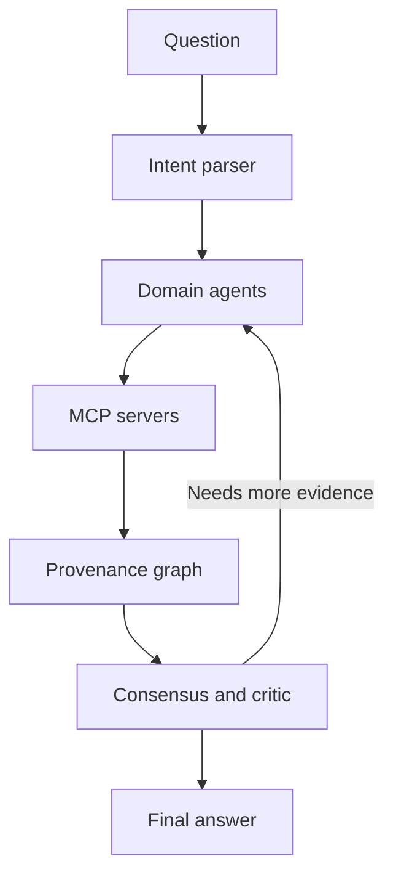

# AstralGraph

AstralGraph is a verifiable AI research assistant for astronomy and space questions.
It combines multi-agent orchestration, Model Context Protocol (MCP) tool servers,
retrieval, a provenance knowledge graph, cross-source consensus checks, and a critic
pass before returning an answer.

The project is built as a software-engineering system rather than a prompt demo: it has
a FastAPI service, Streamlit dashboard, custom MCP servers, guardrails, tests, Docker
support, and an evaluation harness.

## Problem

General-purpose AI assistants can produce fluent scientific answers with numbers that
look precise but are not traceable. AstralGraph is designed around a stricter rule:
numbers and factual claims should come from tool results, retrieved documents, or
deterministic calculations that are recorded in a graph with provenance.

If evidence is missing or sources disagree, the system should surface that uncertainty
instead of silently inventing an answer.

## Architecture


```mermaid
flowchart TD
    Q["Question"] --> P["Intent parser"]
    P --> A["Domain agents"]
    A --> M["MCP servers"]
    M --> G["Provenance graph"]
    G --> C["Consensus and critic"]
    C --> O["Final answer"]
    C -->|Needs more evidence| A
```

| Layer | Implementation |
| --- | --- |
| API and streaming | `api/main.py` |
| Multi-agent workflow | `agents/workflow.py`, `agents/orchestrator.py` |
| MCP client and registry | `core/mcp_client.py`, `core/mcp_registry.py` |
| Custom MCP servers | `mcp_servers/` |
| Retrieval | `rag/` |
| Provenance graph and consensus | `graph/` |
| Guardrails | `guardrails/` |
| Evaluation | `eval/` |
| Dashboard | `ui/app.py` |

Detailed notes are in [docs/architecture.md](docs/architecture.md),
[docs/evaluation.md](docs/evaluation.md), and [docs/operations.md](docs/operations.md).

## High-Level MCP Connections

AstralGraph treats MCP as the boundary between reasoning agents and external
capabilities. The registry in `core/mcp_registry.py` defines which servers exist and
which agents can reach them.

| Agent | MCP servers |
| --- | --- |
| `intent_parser` | none |
| `neo_agent` | `nasa_neo`, `jpl_sbdb`, `astro_compute` |
| `exoplanet_agent` | `exoplanet`, `astro_compute` |
| `events_agent` | `iss`, `eonet`, `space_weather`, `launch`, `astro_compute` |
| `literature_agent` | `rag`, `brave_search` |
| `critic_agent` | `astro_compute`, `jpl_sbdb`, `memory` |
| `orchestrator` | `filesystem`, `memory` |
| `ingest` | `rag`, `filesystem` |
| `eval_harness` | none |

Use `GET /mcp/topology` to inspect this map as JSON without starting live MCP tool
sessions. Use `GET /mcp/tools` when you want live tool discovery from reachable
servers.

## Key Capabilities

- Stateful multi-agent workflow with domain routing.
- MCP-based tool access instead of direct ad hoc network calls from agents.
- Agent permission matrix for least-privilege tool use.
- Custom MCP servers for NEOs, exoplanets, ISS position, EONET events, JPL small-body data,
  space weather, launches, astronomy calculations, and local RAG.
- Typed fact capture with source, URL, MCP server, tool, timestamp, and confidence.
- Cross-source consensus and contradiction detection.
- Guardrails for citations, numeric grounding, schemas, budgets, and policy checks.
- FastAPI endpoints for asking questions, streaming progress, graph inspection, RAG stats,
  MCP discovery, and evaluation results.
- Pytest suite with fast tests separated from live integration tests.

## Setup

### Local Python

```bash
python -m venv .venv
source .venv/bin/activate
python -m pip install --upgrade pip
python -m pip install -r requirements.txt -r requirements-dev.txt
cp .env.example .env
```

Edit `.env` as needed. `NASA_API_KEY=DEMO_KEY` works for demos but is rate-limited.
A real `ANTHROPIC_API_KEY` enables full LLM reasoning; without it, the app uses
deterministic fallbacks where available.

Run the API:

```bash
uvicorn api.main:app --reload
```

Ask a question:

```bash
curl -X POST http://localhost:8000/ask \
  -H "Content-Type: application/json" \
  -d '{"question":"How far is the ISS from London right now?","include_trace":true}'
```

### Docker Compose

```bash
cp .env.example .env
docker compose up --build
```

Open:

- API docs: http://localhost:8000/docs
- Streamlit UI: http://localhost:8501
- Health check: http://localhost:8000/health

To enable the optional Neo4j profile, set `NEO4J_PASSWORD` explicitly before starting it.

## API Surface

| Endpoint | Purpose |
| --- | --- |
| `POST /ask` | Run the full question-answering pipeline. |
| `POST /ask/stream` | Stream progress events and final result. |
| `GET /health` | Service, configuration, RAG, and MCP summary. |
| `GET /mcp/servers` | Server registry and agent permission matrix. |
| `GET /mcp/topology` | High-level agent-to-MCP connection map. |
| `GET /mcp/tools` | Live tool discovery across reachable MCP servers. |
| `GET /rag/stats` | Vector-index health. |
| `POST /rag/ingest` | Ingest seed, arXiv, or HuggingFace astronomy data. |
| `GET /graph/{session_id}` | Graph data for a session. |
| `GET /eval/latest` | Most recent benchmark report, if one has been generated. |

## Testing

Fast tests:

```bash
pytest -m "not integration"
```

Live integration tests:

```bash
pytest -m integration
```

Integration tests may spawn MCP subprocesses and call public APIs, so CI keeps them
manual.

Evaluation harness:

```bash
python -m eval.harness
python -m eval.harness --concurrency 3
python -m eval.harness --only q08 q15
```

## Project Structure

```text
agents/        Agent roles, prompts, workflow, critic, orchestration
api/           FastAPI application and endpoints
core/          Config, LLM wrapper, MCP hub, server registry, telemetry
eval/          Benchmark questions, harness, scoring
graph/         Fact schema, graph store, grounding, consensus
guardrails/    Budget, citation, numeric, permission, policy, schema checks
mcp_servers/   Custom MCP servers for astronomy and space data/tools
rag/           Ingestion, embeddings, vector store, retrieval
scripts/       Utility scripts
tests/         Unit and integration tests
ui/            Streamlit dashboard
```

## Security And Configuration

Configuration is environment-driven through `.env.example`. The repository ignores
local `.env` files, generated storage, workspace data, test caches, and evaluation
outputs.

CORS is controlled by `ASTRAL_CORS_ORIGINS`. The default is limited to local UI
origins. Use `*` only for disposable local demos.

## License

MIT. See [LICENSE](LICENSE).
