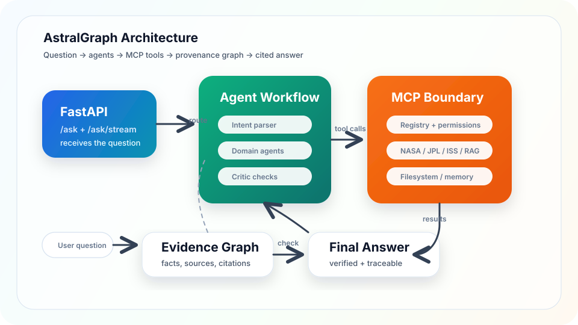
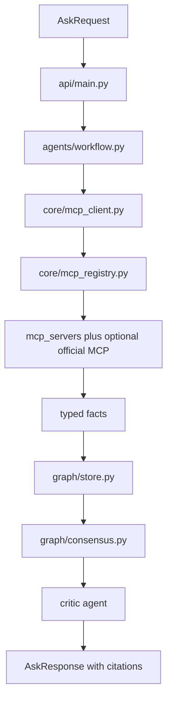

# Architecture

AstralGraph is organized around one rule: final answers should be grounded in facts
that were fetched, computed, or retrieved by controlled tools and recorded with
provenance.

## System Diagram

The API also exposes the live topology through `GET /mcp/topology`. That endpoint is
useful for demos because it shows the agent-to-server connections without launching
tool sessions.

## Request Flow

1. The FastAPI service receives an `AskRequest`.
2. The intent parser classifies the question and extracts entities.
3. Domain agents call permitted MCP servers through the shared MCP hub.
4. Tool results are normalized into typed facts.
5. The graph records facts with source, source URL, server, tool, timestamp, and
   confidence.
6. The consensus layer clusters facts and records support or contradiction edges.
7. The critic checks the draft answer against available evidence.
8. The orchestrator returns the answer, caveats, citations, trace data, and graph data
   when requested.

## Main Components

| Component | Responsibility |
| --- | --- |
| `agents/` | Intent parsing, domain-specific work, critic review, final synthesis. |
| `core/mcp_client.py` | Starts MCP stdio sessions, discovers tools, enforces budgets. |
| `core/mcp_registry.py` | Defines available servers and the agent permission matrix. |
| `mcp_servers/` | Custom MCP servers for live data, calculations, and local RAG. |
| `graph/` | Typed facts, graph storage, grounding, consensus checks. |
| `guardrails/` | Policy, citation, numeric, schema, permission, and budget checks. |
| `rag/` | Corpus ingestion, embeddings, vector store, and retrieval. |
| `eval/` | Fixed benchmark questions, scoring, and report generation. |

## MCP Permission Model

Agents do not directly call arbitrary external APIs. They request calls through the MCP
hub. The hub checks that:

- The target server exists in the registry.
- The requesting agent is allowed to use that server.
- The session still has remaining tool-call budget.
- The result can be captured and traced.

This preserves the existing architecture while making external actions auditable.

## High-Level MCP Connection Map

The MCP registry is the control plane for tool access. It separates custom astronomy
servers from official pre-built MCP servers and gives each agent only the servers it
needs for its role.

| Agent | Role | MCP connection |
| --- | --- | --- |
| `intent_parser` | Classifies the question and extracts entities. | No tool access. |
| `neo_agent` | Near-Earth object questions. | `nasa_neo`, `jpl_sbdb`, `astro_compute` |
| `exoplanet_agent` | Confirmed exoplanet search and summaries. | `exoplanet`, `astro_compute` |
| `events_agent` | ISS, Earth events, space weather, launches. | `iss`, `eonet`, `space_weather`, `launch`, `astro_compute` |
| `literature_agent` | Retrieval and web-backed literature lookup. | `rag`, `brave_search` |
| `critic_agent` | Re-checks calculations and selected source claims. | `astro_compute`, `jpl_sbdb`, `memory` |
| `orchestrator` | Session-level synthesis and persistence. | `filesystem`, `memory` |
| `ingest` | Offline corpus loading. | `rag`, `filesystem` |
| `eval_harness` | Benchmark execution. | No tool access. |

The important design point is that the connection map is explicit data, not an informal
convention. `GET /mcp/servers` exposes the registry and permission matrix, while
`GET /mcp/topology` exposes a client-friendly topology view with agents, servers,
edges, evidence servers, disabled optional servers, and independent source pairs.

Official MCP servers are optional because they require Node's `npx` runtime and, for
Brave Search, a `BRAVE_API_KEY`. If they are unavailable, the topology endpoint marks
them disabled instead of hiding them.

## Provenance And Consensus

Facts carry enough metadata to answer "where did this come from?" The consensus module
groups facts by subject and predicate, then distinguishes:

- single-source claims
- corroborated multi-source claims
- contradictions
- unit mismatches

Contradictions and unit mismatches are retained in the graph rather than hidden.
